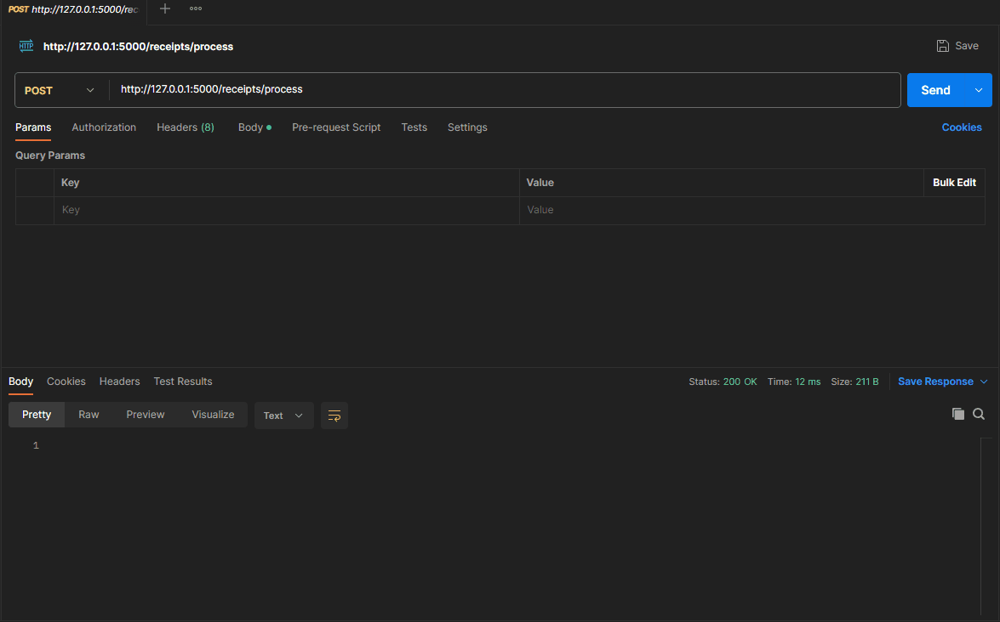
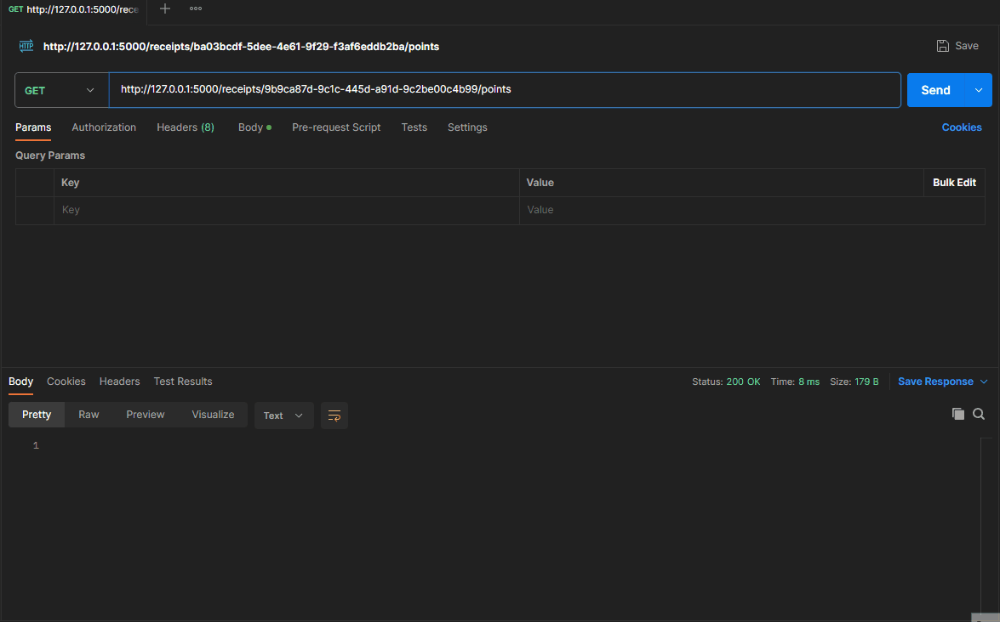

# Receipt-processor-challenge_by_A-MMz
A Flask-based application that processes receipts and calculates points based on predefined rules. The application provides RESTful API endpoints, which can be tested using tools like Postman.

## Getting Started
These instructions will help you get a copy of the project up and running on your local machine for development and testing purposes.

### Prerequisites
- Python (version used: 3.11.5, but other 3.x versions should work)
- Docker (optional, for containerized deployment)
- Postman (for API testing)
## Running the App - Using Local Environment
1. Clone the Repository:
   ```
   git clone https://github.com/A-MMz/receipt-processor-challenge_by_A-MMz
   cd flask-receipts-app
   ```
2. Install Dependencies:
   ```
   pip install -r requirements.txt
   ```
3. Run the App:
   ```
   python app.py
   ```

The Flask app should now be running at: 'http://127.0.0.1:5000'

## Running the App - Using Docker
1. Build the Docker Image:
   ```
   docker build -t flask-receipts-app .
   ```
2. Run the Docker Container:
   ```
   docker run -p 5000:5000 flask-receipts-app
   ```

The Flask app should now be running in a Docker container and accessible at http://localhost:5000.

## Testing with Postman
1. Install and Open Postman.
2. Configure a New Request:
- Method: POST
- URL: http://localhost:5000/receipts/process
- Body: Choose raw and JSON, then input a receipt JSON, for example:
```json
{
  "retailer": "Target",
  "purchaseDate": "2022-01-01",
  "purchaseTime": "13:01",
  "items": [
    {
      "shortDescription": "Mountain Dew 12PK",
      "price": "6.49"
    },{
      "shortDescription": "Emils Cheese Pizza",
      "price": "12.25"
    },{
      "shortDescription": "Knorr Creamy Chicken",
      "price": "1.26"
    },{
      "shortDescription": "Doritos Nacho Cheese",
      "price": "3.35"
    },{
      "shortDescription": "   Klarbrunn 12-PK 12 FL OZ  ",
      "price": "12.00"
    }
  ],
  "total": "35.35"
}
```
3. Send the Request to see the response which will contain the receipt ID.
   


4. Get Points for a Receipt:

- Method: GET
- URL: http://localhost:5000/receipts/{RECEIPT_ID}/points (replace {RECEIPT_ID} with the actual ID from the previous response)


